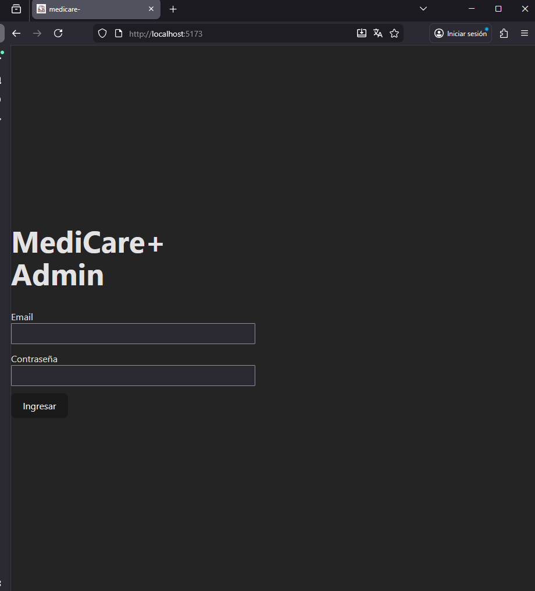
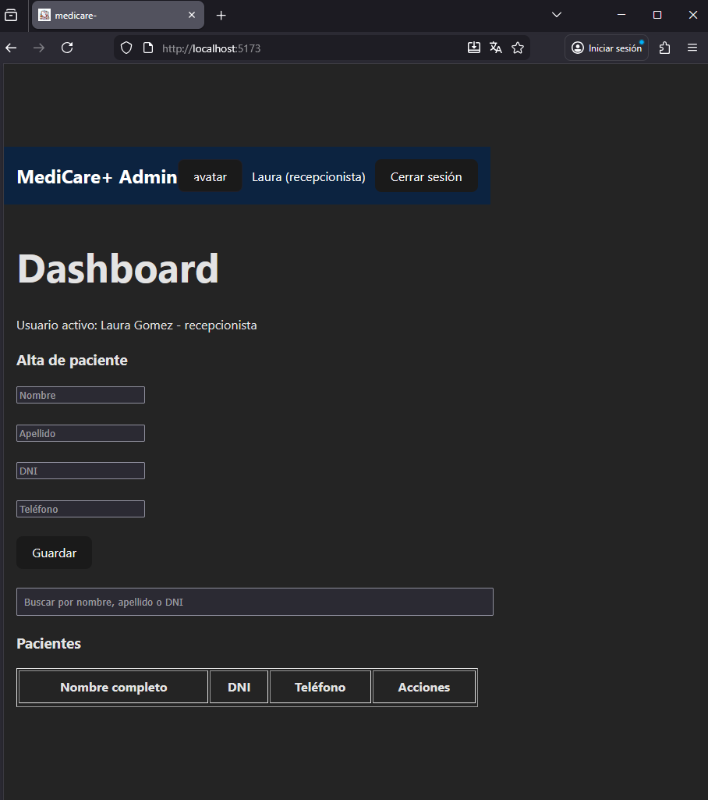
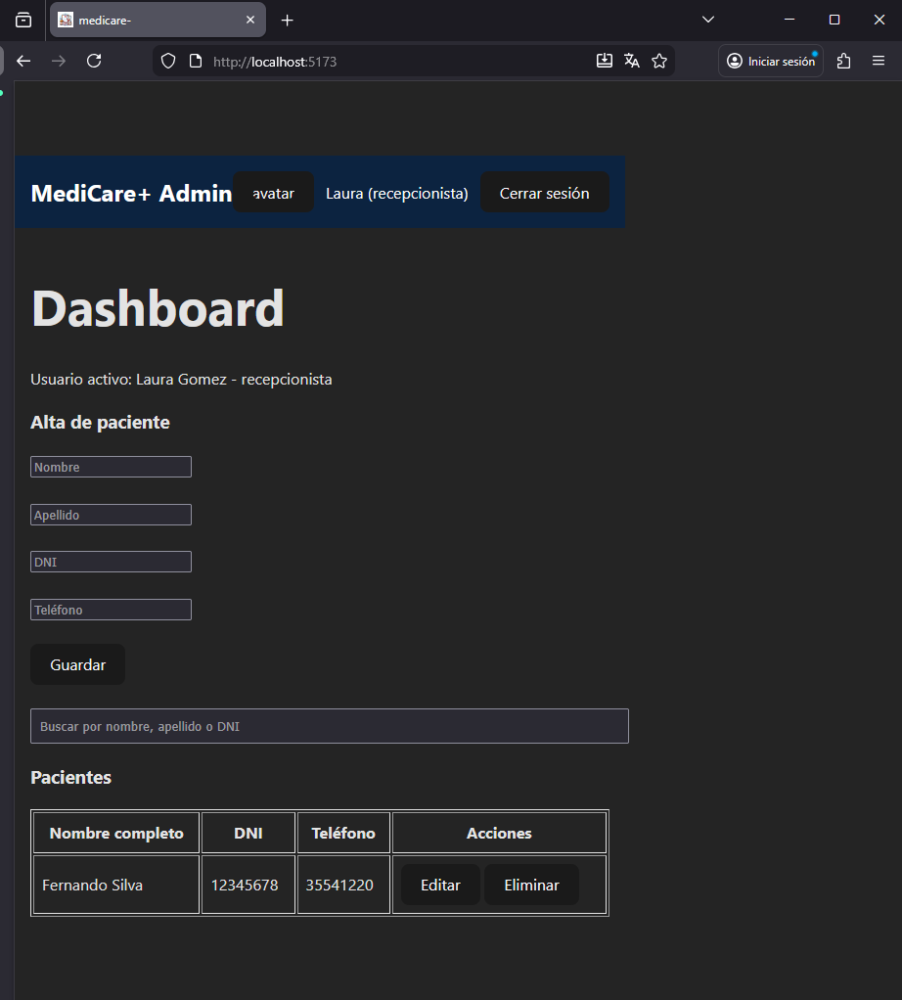
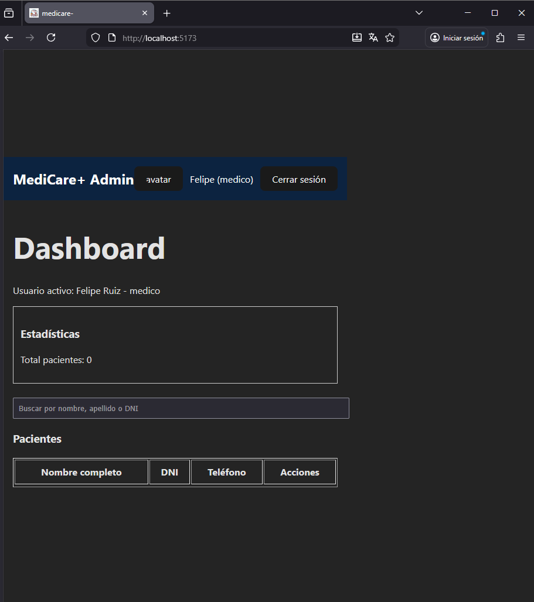
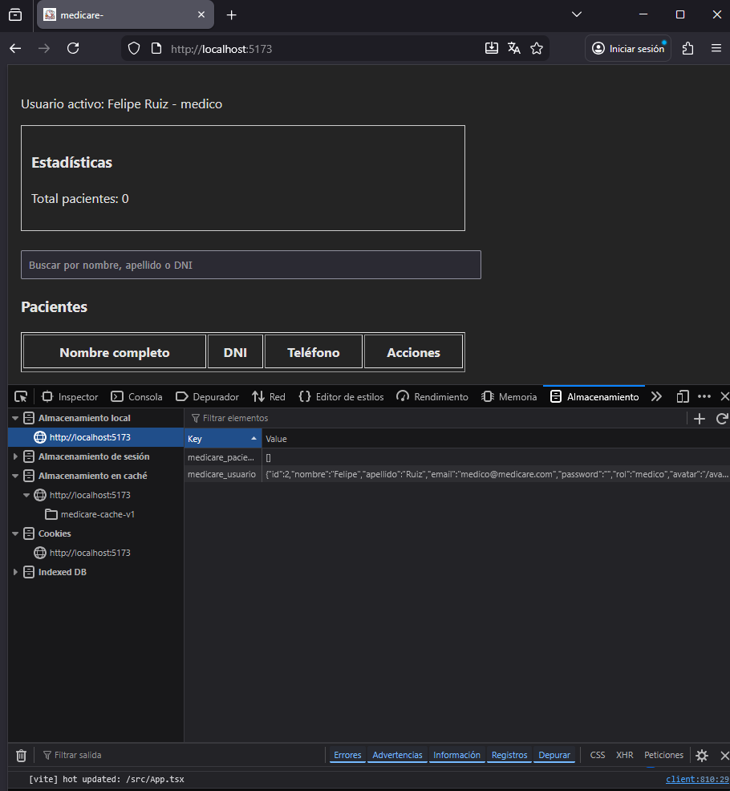

1. Inicio de sesion 
 

2. Menu de recepcionista
   

3. Agregacion de usuario 

4. Sesion de medico
   

5. localStorage
Hay un problema con el localStorage,y lo que sucede es si se guarda pero el usuario no lo encuentra y crea un nuevo localStorage donde se guardan los datos pero depues se borra. 
por cuestion de tiempo lo deje asi.

