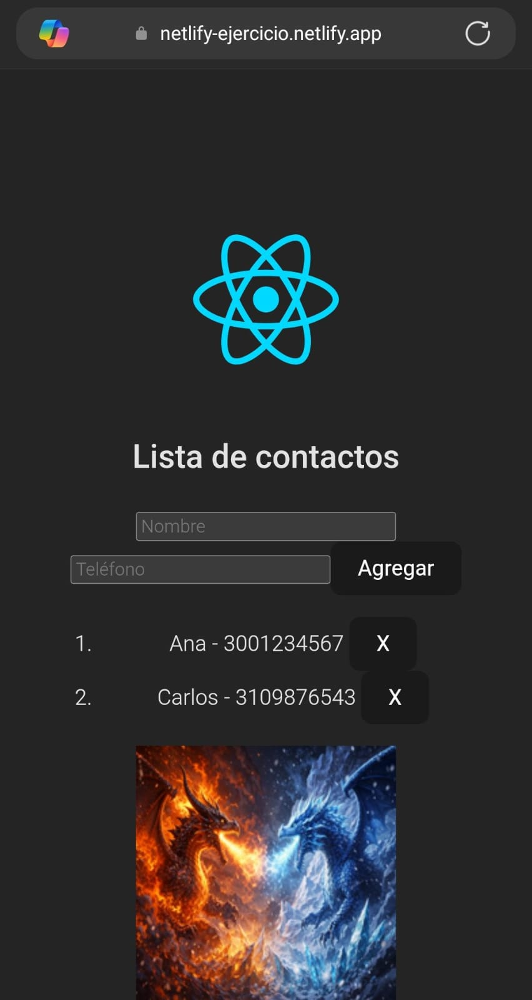
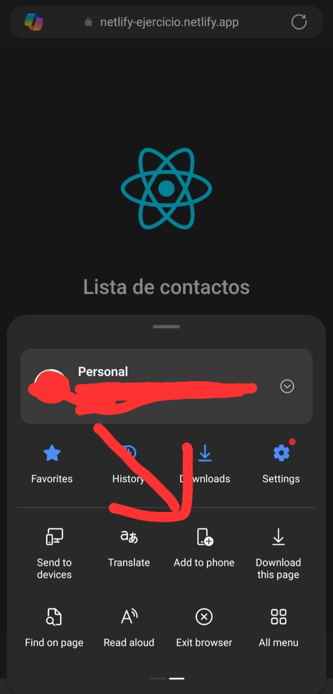

# Readme

# Proceso de instalación de app

1. Ingresa al siguiente enlace desde su dispositivo móvil:  
   Enlace: [entregas](https://netlify-ejercicio.netlify.app/)

    

2. Dentro de su buscador de preferencia busca el botón de opciones, en este caso de Edge el botón está en la parte baja al lado izquierdo.

    

      
      
      
    

3. Después busca la opción que diga agrega al celular y presiona, este le pedidera permiso para instalar la aplicación en su dispositivo móvil.

    

4. Luego de instalar la web aparece en sección de aplicaciones

    
