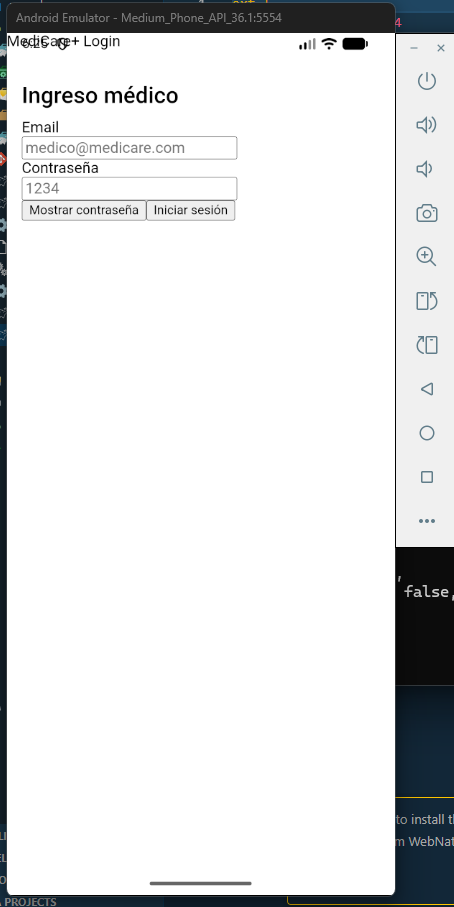
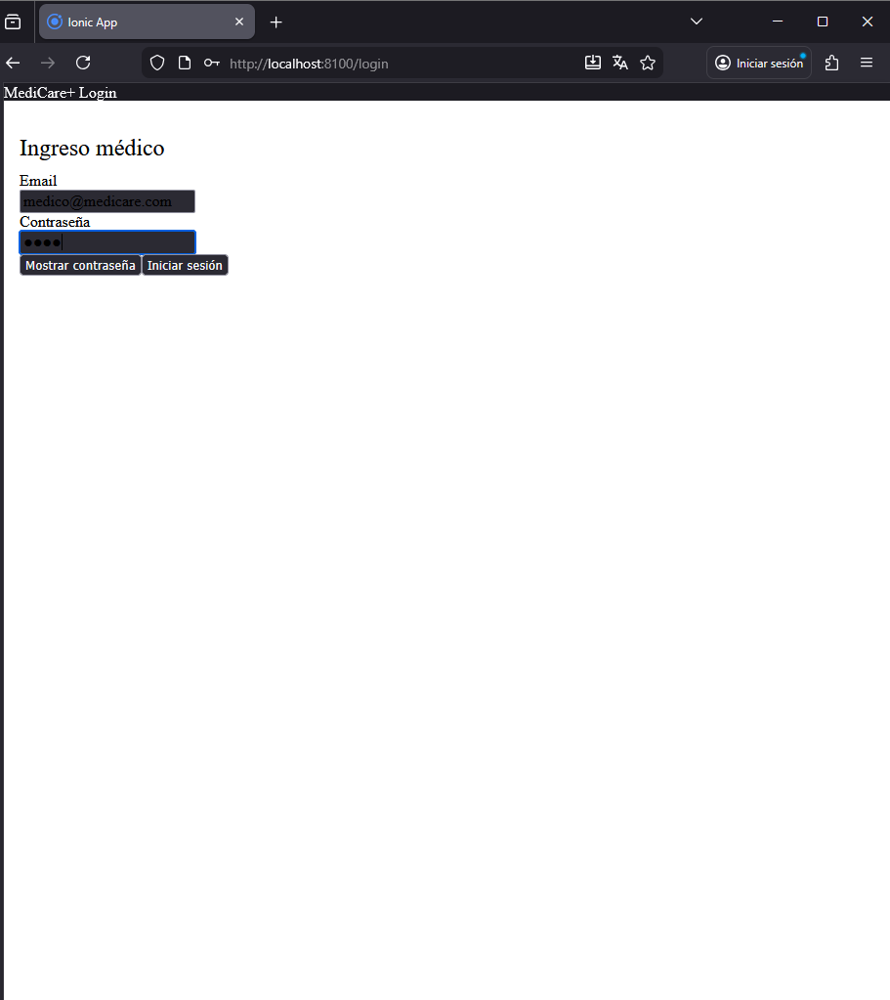
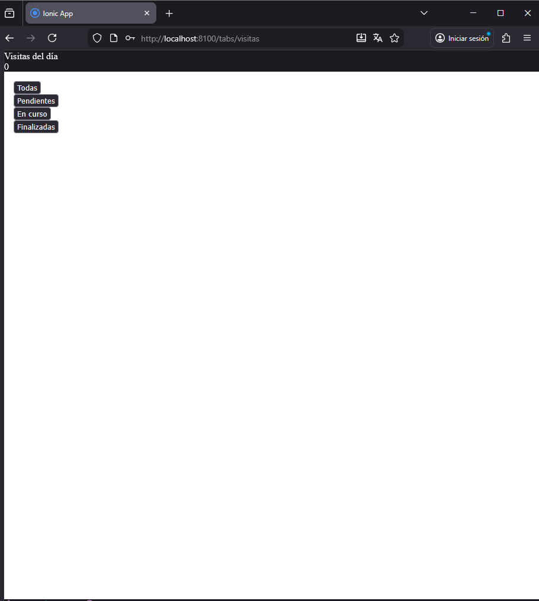
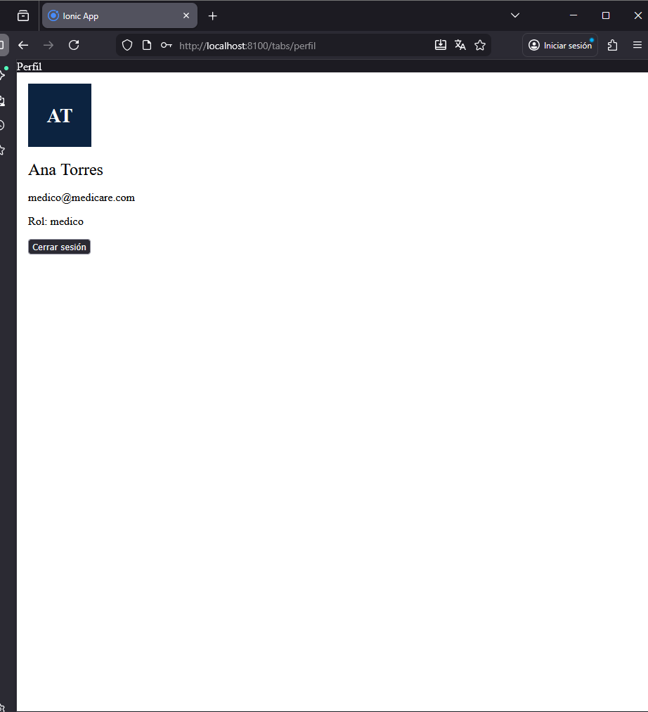

1. app funcionando en AndroidStudio, no se pudo iniciar sesion por lo que requiere el @ y android studio no lo reconoce
   

2. Inicio de sesion 

3. Pagina principal

4.Menu de pacientes

5. Pagina para ver el usuario con el que se incio sesion

6. Porblema con el LocalStorage, Se guardan los user dentro del localSStorage pero no muestra los pacientes guardados 
   

